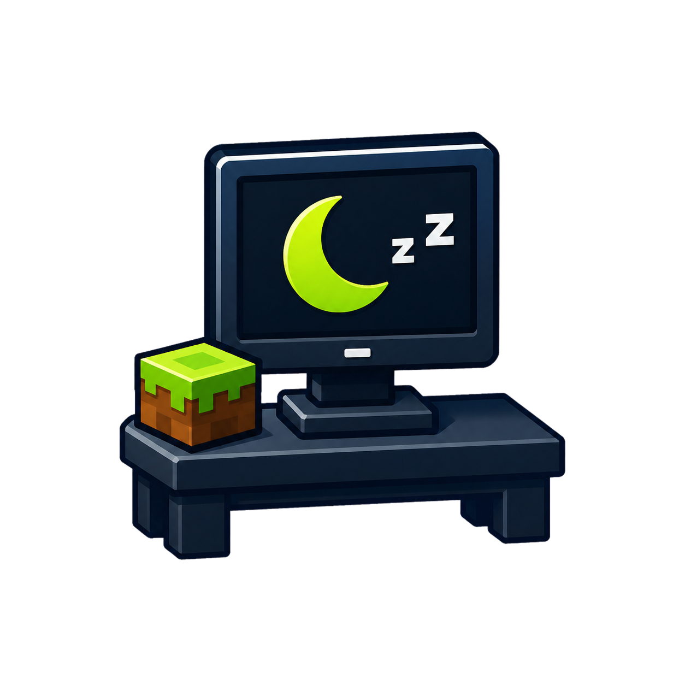

<p align="center">
  
</p>

<h1 align="center">AFK Desk</h1>

<p align="center">
  A free, local-first Minecraft Java connection client for keeping your own accounts online without running the full game.
</p>

<p align="center">
  <a href="https://github.com/legendary-cookie/afk-desk/releases/latest"></a>
  <a href="https://github.com/legendary-cookie/afk-desk/actions/workflows/ci.yml"></a>
  <a href="LICENSE"></a>
</p>

<p align="center">
  <a href="https://github.com/legendary-cookie/afk-desk/releases/download/v0.7.0/AFK-Desk-Setup-0.7.0.exe"><strong>Download AFK Desk 0.7.0 for Windows</strong></a>
  · <a href="https://github.com/legendary-cookie/afk-desk/releases/tag/v0.7.0">Release notes</a>
  · <a href="HISTORY.md">Version history</a>
</p>

AFK Desk supports multiple Microsoft-authenticated accounts, chat and commands, customizable anti-AFK behavior, live player state, inventory actions, proxies, startup connections, and automatic reconnect. It has no subscriptions, analytics, or account-count limits.

## What is new in 0.7.0

- New AFK Desk branding, Windows icon, and visible installed-version labels.
- Independently resizable console, controls, and inventory panels with persistent sizes.
- Responsive panel contents that wrap and compact instead of hiding details or buttons.
- Safer automatic Minecraft version selection across proxy lobby and backend switches.
- Browser sharing, Tailscale integration, and the local remote-control server are removed for now.

See the [complete 0.7.0 release notes](https://github.com/legendary-cookie/afk-desk/releases/tag/v0.7.0) for verification details and the installer checksum.

## Features

- Multiple Microsoft accounts with automatic IGN and player-head discovery
- Microsoft device-code authentication without collecting account passwords
- Automatic Minecraft version detection with stable same-server version reuse
- Fixed-size scrolling console, Minecraft chat colors, commands, history, and editable macros
- Separate configurable initial-join and server-change messages
- Automatic reconnect with exponential backoff and stalled-connection recovery
- Custom anti-AFK actions, randomized timing, duration, look angle, and bounded walking distance
- Default environmental movement from water, knockback, explosions, players, and mobs
- Held mouse and keyboard movement controls, including WASD and Space
- Per-account SOCKS5 and HTTP CONNECT proxies with Windows-encrypted proxy passwords
- Optional Windows startup and per-account automatic connections with configurable staggering
- Live health, hunger, coordinates, dimension, water-current, chest, and inventory views
- Selection and explicit dropping of individual inventory stacks
- Minecraft-style gear, inventory, and hotbar grids with vanilla item icons, stack counts, durability bars, enchantment glint, and hover tooltips
- Drag or move stacks between slots, choose the held hotbar item, and equip armor or off-hand gear
- Optional nearby-chest auto-deposit with traceable chest coordinates
- Interactive Minecraft-style chest-menu popups for server commands
- Modern Velocity server-switch compatibility
- Interface scaling and persistent responsive panel layouts

## Downloads

| Platform | Version | Download | Notes |
| --- | --- | --- | --- |
| Windows desktop | 0.7.0 | [Installer](https://github.com/legendary-cookie/afk-desk/releases/download/v0.7.0/AFK-Desk-Setup-0.7.0.exe) | Primary Electron + Mineflayer client |
| Android | 0.1.0 | [APK](https://github.com/legendary-cookie/afk-desk/releases/download/v0.4.1/AFK-Desk-Mobile-0.1.0.apk) | Earlier standalone mobile preview |
| iOS | 0.1.0 source | [Build instructions](mobile/BUILDING.md) | Requires macOS, Xcode, and personal signing |

GitHub provides ZIP and TAR source archives on every [release page](https://github.com/legendary-cookie/afk-desk/releases). Published artifact hashes are recorded in [RELEASE_CHECKSUMS.txt](RELEASE_CHECKSUMS.txt).

## Projects

| Project | Stack | Current version | Notes |
| --- | --- | --- | --- |
| [`desktop/`](desktop/) | Electron + Mineflayer | 0.7.0 | Primary Windows desktop client |
| [`mobile/`](mobile/) | React Native + embedded Node.js | 0.1.0 | Standalone Android preview and iOS Xcode source |
| [`fabric-movement-diagnostics/`](fabric-movement-diagnostics/) | Fabric | Reference utility | Compares vanilla movement diagnostics without account secrets |

## Run from source

Requires Node.js 22 or newer.

```powershell
cd desktop
npm ci
npm test
npm start
```

Build the Windows installer with `npm run dist`. See [`desktop/README.md`](desktop/README.md) for desktop behavior and [`mobile/BUILDING.md`](mobile/BUILDING.md) for mobile build requirements.

## Privacy and security

- Microsoft passwords never enter AFK Desk; authentication is handled through Microsoft device-code sign-in and Prismarine Auth.
- Cached Microsoft tokens remain in the local Electron user-data directory.
- Optional proxy passwords use Electron safe storage backed by Windows credential protection.
- The desktop app does not start a browser dashboard or remote HTTP-control server.
- There is no analytics or telemetry service. Local diagnostic logs are bounded and redact credentials.

See [SECURITY.md](SECURITY.md) and [`desktop/SECURITY.md`](desktop/SECURITY.md) for the security model and dependency-advisory status.

## Responsible use

Use AFK Desk only with accounts and servers you are authorized to access. Server rules may prohibit AFK clients, automation, multiple accounts, or proxies. AFK Desk does not bypass Microsoft authentication, server permissions, bans, or paid third-party services.

AFK Desk is not affiliated with Mojang, Microsoft, Minecraft, Valoks, or AFK Console Client.

## License

[MIT](LICENSE)
